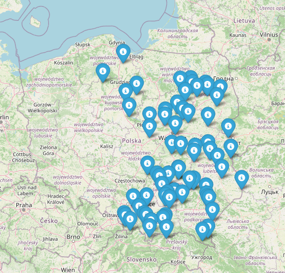
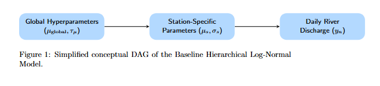
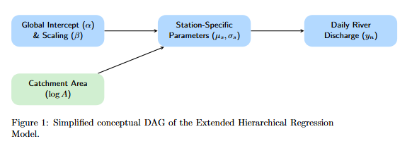
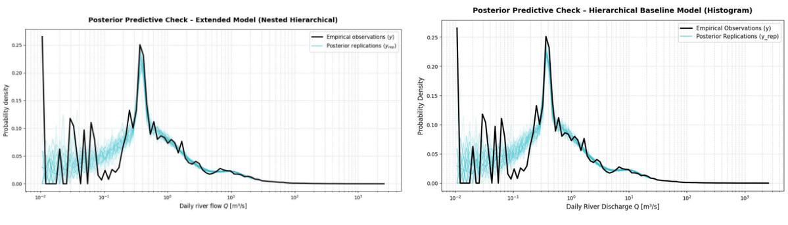
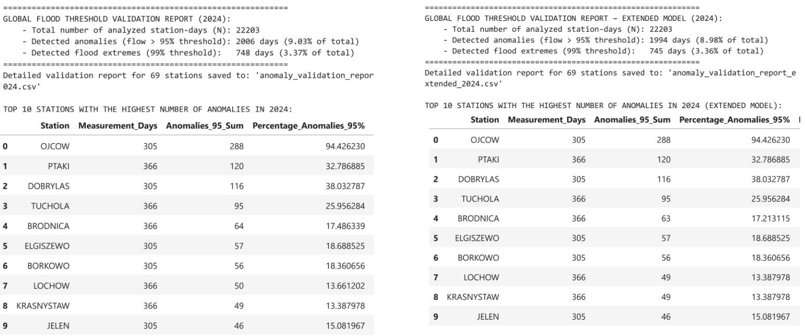

# Bayesian Modelling of River Flow Anomaly Detection in the Vistula Basin
[](https://mc-stan.org/)
[](https://mc-stan.org/)
[](https://grdc.bafg.de/)
> **Course Project**: Data Analysis  
> **Authors**: [Paweł Jerzyna](https://github.com/pjerzyna), Piotr Grzyb  
> **Method**: Hierarchical log-normal models in Stan with probabilistic per-station anomaly thresholds

## 🌊 Project Overview

A fully Bayesian workflow for detecting anomalous daily river discharges across the Vistula basins. The project builds a family of hierarchical log-normal models in Stan, calibrates them on daily flow observations from 2023, derives per-station probabilistic anomaly thresholds, and backtests them on out-of-sample data from 2024.

Daily river discharge $Q$ is strongly right-skewed: most days are dominated by low base flows, while floods are rare, extreme deviations. We model $Q$ with a log-normal likelihood inside a hierarchical structure that shares statistical strength across gauging stations (and, in the extended model, across rivers). Rather than forecasting day-to-day hydrographs, the models act as stationary marginal density estimators: they characterize the climatological probability distribution of flow magnitudes at each station and convert the posterior into interpretable 95% (anomaly) and 99% (extreme / flood) warning thresholds.


## 📊 Data

- 📥 **Source:** Daily discharge records provided by the [Global Runoff Data Centre (GRDC)](https://grdc.bafg.de/) for hydrological stations in the Vistula basin
- 📐 **Period:** 2023 (training / baseline year) and 2024 (out-of-sample validation year)
- 🔢 **Scale:** $N > 22{,}000$ daily observations, $S = 69$ gauging stations, grouped into $R$ rivers
- 📋 **Variables:** daily discharge $Q$ [m³/s], station coordinates, altitude, and catchment area [km²]

The cleaning pipeline extracts the years 2023–2025 from raw GRDC files, converts them to flat CSVs with row-level metadata (river, station, coordinates, catchment area, altitude), and enforces a strict integrity check: the log-normal likelihood requires $y > 0$, so the pipeline halts on any non-positive values instead of silently filtering the data.

## 📍 Gauging Station Network

The measurement points span the entire Vistula basin which have up to date data. From small mountain headwater catchments in the Carpathians (e.g., Zakopane Harenda, ~1.8 m³/s median flow) to massive lowland channels near the river mouth (e.g., Tczew on the Vistula, validation flows up to 3,100 m³/s).

<p align="center">
  
</p>
<p align="center"><em>Spatial distribution of the 69 gauging stations used in the study

## 🧮 Models

### 1. Baseline Hierarchical Log-Normal Model

A two-level hierarchy: station-specific parameters $(\mu_s, \sigma_s)$ are drawn from shared, country-wide global hyperparameters. A centered parameterization is used, which is optimal in this data-rich regime (25k+ observations), and the noise scale is modeled in log-space, guaranteeing $\sigma_s > 0$.

<p align="center">
  
</p>

**Model equations:**

$$y_n \sim \text{LogNormal}(\mu_{s[n]}, \sigma_{s[n]})$$

$$\mu_s \sim \mathcal{N}(\mu_{\text{global}}, \tau_{\mu}), \qquad \log\sigma_s \sim \mathcal{N}(\log\sigma_{\text{global}}, \tau_{\sigma}), \qquad \sigma_s = \exp(\log\sigma_s)$$

**Priors** (the 99th percentile of simulated flows reaches a physically realistic ceiling of ~5,000 m³/s):

| Parameter | Prior | Role |
| :--- | :--- | :--- |
| $\mu_{\text{global}}$ | $\mathcal{N}(3,\ 1.2)$ | Country-wide mean log-flow |
| $\tau_{\mu}$ | $\text{Half-}\mathcal{N}(0,\ 1.2)$ | Inter-station variability of means |
| $\log\sigma_{\text{global}}$ | $\mathcal{N}(0,\ 0.5)$ | Baseline noise scale |
| $\tau_{\sigma}$ | $\text{Half-}\mathcal{N}(0,\ 0.5)$ | Inter-station variability of noise scales |


### 2. Extended Nested Hierarchical Model

Adds a third grouping level - the river - so that stations partially pool toward their parent river's profile: observation $n$ → station $s[n]$ → river $r[s[n]]$. To eliminate divergent transitions, the model uses a hybrid parameterization: non-centered at the sparse Global → River level (removing Neal's funnel geometry) and centered at the data-rich River → Station level.

<p align="center">
  
</p>

**Model equations:**

$$y_n \sim \text{LogNormal}(\mu_{s[n]}, \sigma_{s[n]})$$

River → Station level (centered):

$$\mu_s \sim \mathcal{N}(\mu_{r[s]},\ \tau_{\mu,\text{sta}}), \qquad \log\sigma_s \sim \mathcal{N}(\log\sigma_{r[s]},\ \tau_{\sigma,\text{sta}}), \qquad \sigma_s = \exp(\log\sigma_s)$$

Global → River level (non-centered):

$$\mu_r = \mu_{\text{global}} + \tau_{\mu,\text{riv}} \cdot z_{\mu,r}, \qquad \log\sigma_r = \log\sigma_{\text{global}} + \tau_{\sigma,\text{riv}} \cdot z_{\sigma,r}, \qquad \sigma_r = \exp(\log\sigma_r)$$

$$z_{\mu,r} \sim \mathcal{N}(0,\ 1), \qquad z_{\sigma,r} \sim \mathcal{N}(0,\ 1)$$

The global-level hyperparameters define the national reference point, while the $\tau$ parameters at each level control the strength of shrinkage: the smaller $\tau$, the more strongly stations are pulled toward the mean of their parent river.

**Priors:**

| Parameter | Prior | Role |
| :--- | :--- | :--- |
| $\mu_{\text{global}}$ | $\mathcal{N}(3,\ 1.2)$ | Global reference point for the logarithm of river flows at the national scale |
| $\log\sigma_{\text{global}}$ | $\mathcal{N}(0,\ 0.5)$ | Central baseline value for the noise scale (within-station variance) |
| $\tau_{\mu,\text{riv}}$ | $\text{Half-}\mathcal{N}(0,\ 1.2)$ | Scale of variability in mean flows between rivers |
| $\tau_{\sigma,\text{riv}}$ | $\text{Half-}\mathcal{N}(0,\ 0.5)$ | Scale of variability in flow dispersion dynamics between rivers |
| $\tau_{\mu,\text{sta}}$ | $\text{Half-}\mathcal{N}(0,\ 1.2)$ | Local variability of station means within the same river |
| $z_{\mu,r}$ | $\mathcal{N}(0,\ 1)$ | Standardized location deviation for river $r$ |
| $z_{\sigma,r}$ | $\mathcal{N}(0,\ 1)$ | Standardized scale deviation for river $r$ |


## 🔍 Posterior Predictive Checks

Both the baseline and the extended models reproduce the empirical flow distribution remarkably well, regarding small flows.

<p align="center">
  
</p>
<p align="center"><em>The global fits are visually near-indistinguishable - but the internal decomposition differs.</em></p>

Although the two fits look almost identical, the nested hierarchy changes the internal story. By separating station- and river-level variation, the extended model lowers the global median flow estimate from ≈18.2 m³/s (baseline, $\mu_{\text{global}} = 2.901$) to ≈9.8 m³/s (extended, $\mu_{\text{global}} = 2.285$), preventing clusters of highly active or closely located stations from disproportionately driving the national baseline upward. The variance decomposition reveals two hydrologically meaningful facts:

- **Typical flow magnitude is predominantly station-location dependent** ($\tau_{\mu,\text{sta}} = 1.453 > \tau_{\mu,\text{riv}} = 1.212$) - local geomorphology matters more than which river a gauge sits on.
- **Flow volatility is predominantly shared within the parent river basin** ($\tau_{\sigma,\text{riv}} = 0.447 \gg \tau_{\sigma,\text{sta}} = 0.178$) - dispersion dynamics are dictated by basin-wide characteristics rather than by individual gauges.

Both models share the same structural limitation at the extreme low-flow boundary ($Q \leq 0.1$ m³/s): the continuous log-normal likelihood blurs and overestimates density there because it cannot reproduce the sharp, discrete empirical spikes caused by coarse measurement resolution. This artifact persists even in the extended model, confirming it is a property of the log-normal observation model rather than of the hierarchical structure.


## 🚨 Anomaly Detection & 2024 Validation

Per-station warning thresholds are derived analytically from the log-normal quantile formula for every MCMC draw, then aggregated with the posterior median:

$$Q_{95,s} = \text{median}\left[\exp(\mu_s + 1.645\,\sigma_s)\right], \qquad Q_{99,s} = \text{median}\left[\exp(\mu_s + 2.326\,\sigma_s)\right]$$

$Q_{95}$ acts as the anomaly warning level and $Q_{99}$ as the flood level. 

**Aggregate exceedance rates (2024):**

| Metric | Nominal | Baseline | Extended (Nested) |
| :--- | :---: | :---: | :---: |
| Anomalies ($Q > Q_{95}$) | 5% | 2,006 days — 9.03% | 1,994 days — 8.98% |
| Flood extremes ($Q > Q_{99}$) | 1% | 748 days — 3.37% | 745 days — 3.36% |

Both models fire well above the nominal 5% / 1% rates, and the two are almost indistinguishable operationally (baseline vs extended differ by ~12 anomaly-days out of 22,203).

<p align="center">
  
</p>
<p align="center"><em> Top stations by 2024 anomaly rate </em></p>


The ranking exposes a clear failure mode rather than a hydrological one: **OJCÓW flags 94% of all days as anomalous**, which is diagnostic of a poor per-station fit rather than of a genuinely anomalous year at that gauge. The extended model reproduces this ranking almost exactly - only marginal shifts (e.g. BRODNICA 64 → 63, LOCHOW 50 → 49 anomaly-days) - confirming that the nested hierarchy sharpens the interpretation of variance (station vs river) far more than it changes downstream alarm behaviour.


## ⚖️ Model Comparison (LOO / WAIC)

Information-theoretic comparison of the baseline and v2 models on a 3,000-observation subsample yields:

$$\Delta\text{LOO} = 0.05 \pm 169.36 \quad \Rightarrow \quad \textbf{statistically indistinguishable}$$

Neither river-level partial pooling nor the catchment covariate improves out-of-sample predictive quality. With $N_s \approx 300$–500 observations per station, the **likelihood overwhelms the prior**: each station has enough data to estimate its own parameters, leaving the hierarchical shrinkage mechanisms with essentially no work to do.

## Key Findings

- **A significant physical-geographic effect exists.** The catchment area covariate is statistically significant: $\alpha_c = -0.117$ (95% CI: $[-0.165, -0.065]$). Smaller catchments exhibit **higher relative flow variability** than large lowland rivers — a well-known hydrological relationship, since large catchments aggregate precipitation over vast areas and smooth out local extremes.
- **…but it is operationally too weak.** The effect changes 95% thresholds by at most 1.14% at any station and shifts no alarm decisions during 2024 backtesting.
- **The baseline model is a strong benchmark.** It captures bulk flow dynamics and flood-tail behavior, converges cleanly, and its thresholds are well calibrated at the national scale.
- **Persistent localized pathologies point to unmodeled physics.** Stations like Ptaki (28.96% false alarms) and Dobrylas (27.2%) deviate identically under every model variant, suggesting local hydraulic factors (reservoir management, flow regulation, flood-plain geometry) rather than statistical miscalibration.

## Limitations & Future Work

1. **Temporal independence assumption.** Daily discharges are strongly autocorrelated (catchment routing, groundwater recession); treating them as i.i.d. underestimates posterior variance. An **AR(1)** or latent state-space extension is the natural next step.
2. **No seasonality.** Parameters $\mu_s, \sigma_s$ are constant across the year, ignoring spring snowmelt floods and summer–autumn low flows. A time-varying component $\mu_s(t)$ would directly address the PTAKI pathology.
3. **Continuous likelihood at low flows.** The log-normal cannot represent discrete sensor-limit artifacts at $Q < 0.1$ m³/s; a censored or mixture likelihood could.
4. **Additional stable covariates.** Altitude (m ASL) is available in the dataset and could complement catchment area as a predictor of $\sigma_s$.

## Repository Structure

```
.
├── nested_hierarchical.ipynb       # Main analysis notebook (English)
├── nested_hierarchical_pl.ipynb    # Main analysis notebook (Polish)
├── stan/
│   ├── model_lognormal_base_prior.stan   # Baseline — prior predictive
│   ├── model_lognormal_base.stan         # Baseline — posterior
│   ├── model_lognormal_ext_prior.stan    # Extended — prior predictive
│   ├── model_lognormal_ext_gen_qq.stan   # Extended v1 — posterior + generated quantities
│   └── model_lognormal_ext_v2.stan       # Extended v2 — catchment covariate
├── dataset/                        # Raw GRDC files
├── dataset_cleaned/                # Extracted TXT (2023–2025)
├── dataset_cleaned_csv/            # Flat CSVs (STATION_RIVER.csv)
├── session_data/                   # Cached posterior draws (.npy) for fast reload
├── media/                         # Figures used in this README
└── data_model_comparison           # Data related to anomaly validation and threshold for particular models
```

## How to Run

**Requirements:** Python 3.10+, [CmdStan](https://mc-stan.org/users/interfaces/cmdstan) installed via CmdStanPy.

```bash
pip install cmdstanpy arviz numpy scipy pandas matplotlib folium xarray
python -c "import cmdstanpy; cmdstanpy.install_cmdstan()"
```

Then open the notebook and run the cells top-to-bottom:

```bash
jupyter notebook nested_hierarchical.ipynb
```

Notes:

- Full MCMC for the extended models uses `adapt_delta=0.99`, `max_treedepth=15`, and `thin=2` (memory management for `generated quantities`); expect a substantial runtime.
- After a first full run, set `MODE = 0` in the *Saving and Loading Data* section to reload cached posterior draws from `session_data/` instead of re-sampling.

---

*This project was developed as a study in principled Bayesian workflow — prior predictive calibration, hierarchical modeling, posterior predictive validation, out-of-sample backtesting, and information-theoretic model comparison — applied to real hydrological data from the Vistula basin.*

> Data were provided by the Global Runoff Data Centre (GRDC), 56068 Koblenz, Germany.